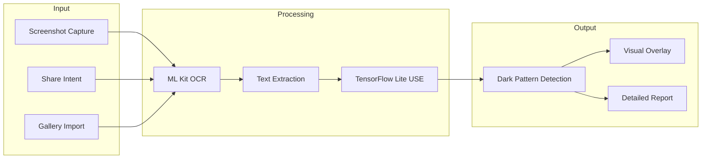
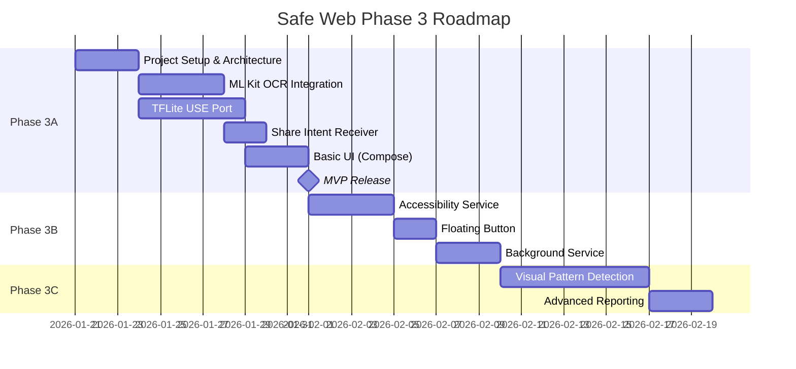

# Safe Web Phase 3: Android Mobile App with Screenshot Analysis

## Overview

This document proposes the design for **Safe Web Phase 3** — an Android mobile app that can capture screenshots (or analyze shared images) and detect dark patterns using on-device AI. This extends the existing Chrome extension's capabilities to the mobile ecosystem, allowing users to analyze any app or website on their device.



---

## User Review Required

> [!IMPORTANT]  
> **Privacy Considerations**: The AccessibilityService approach requires sensitive permissions. Users must explicitly enable the service in Settings. Consider if a simpler "share screenshot" workflow is acceptable for v1.0.

> [!WARNING]  
> **App Store Compliance**: Google Play has strict policies on apps using AccessibilityService. The app must clearly explain why this permission is needed and cannot use it for purposes beyond stated functionality.

---

## Proposed Architecture

### Core Capabilities

| Feature | Description | Priority |
|---------|-------------|----------|
| **Screenshot Capture** | Capture current screen via AccessibilityService or FloatingButton trigger | P0 |
| **Share Intent Receiver** | Accept screenshots shared from other apps | P0 |
| **OCR Text Extraction** | Extract text from images using ML Kit | P0 |
| **Semantic Analysis** | Detect dark patterns using TensorFlow Lite + USE | P0 |
| **Visual Overlay** | Highlight detected patterns on the image | P1 |
| **Pattern History** | Save and review past detections | P2 |
| **Real-time Monitoring** | Continuous background analysis (advanced) | P3 |

### Technology Stack

```
┌─────────────────────────────────────────────────────────┐
│                    Safe Web Android                      │
├─────────────────────────────────────────────────────────┤
│  UI Layer          │ Jetpack Compose (Material 3)       │
├─────────────────────────────────────────────────────────┤
│  Screen Capture    │ AccessibilityService (API 30+)     │
│                    │ MediaProjection API (fallback)      │
├─────────────────────────────────────────────────────────┤
│  Text Extraction   │ ML Kit Text Recognition v2          │
│                    │ (On-device, ~5MB model)             │
├─────────────────────────────────────────────────────────┤
│  Dark Pattern AI   │ TensorFlow Lite                     │
│                    │ Universal Sentence Encoder (~30MB)  │
├─────────────────────────────────────────────────────────┤
│  Local Storage     │ Room Database                       │
│                    │ DataStore Preferences               │
├─────────────────────────────────────────────────────────┤
│  Architecture      │ MVVM + Clean Architecture           │
│                    │ Kotlin Coroutines + Flow            │
└─────────────────────────────────────────────────────────┘
```

---

## Proposed Changes

### Phase 3A: Core MVP (Share-Based Analysis)

A simpler first release that works via Android's Share functionality.

---

#### [NEW] [safe-web-android/](file:///c:/Home/Software/Google_Antigravity/CBS_App/safe-web-android/)

New Android project directory with the following structure:

```
safe-web-android/
├── app/
│   ├── src/main/
│   │   ├── java/com/safeweb/
│   │   │   ├── MainActivity.kt           # Main UI
│   │   │   ├── AnalysisActivity.kt       # Image analysis screen
│   │   │   ├── ml/
│   │   │   │   ├── TextExtractor.kt      # ML Kit OCR wrapper
│   │   │   │   ├── DarkPatternDetector.kt # TFLite USE inference
│   │   │   │   └── PatternTypes.kt       # Dark pattern definitions
│   │   │   ├── ui/
│   │   │   │   ├── components/           # Compose UI components
│   │   │   │   ├── screens/              # Screen composables
│   │   │   │   └── theme/                # Material 3 theming
│   │   │   └── data/
│   │   │       ├── HistoryRepository.kt  # Detection history
│   │   │       └── SettingsStore.kt      # User preferences
│   │   ├── res/
│   │   │   └── values/
│   │   │       └── strings.xml           # Localization
│   │   └── AndroidManifest.xml
│   └── build.gradle.kts
├── assets/
│   └── models/
│       └── use_lite.tflite               # Converted USE model
└── build.gradle.kts
```

---

#### [NEW] [TextExtractor.kt](file:///c:/Home/Software/Google_Antigravity/CBS_App/safe-web-android/app/src/main/java/com/safeweb/ml/TextExtractor.kt)

ML Kit integration for OCR:

```kotlin
class TextExtractor(private val context: Context) {
    private val recognizer = TextRecognition.getClient(TextRecognizerOptions.DEFAULT_OPTIONS)
    
    data class ExtractedText(
        val text: String,
        val boundingBox: Rect,
        val confidence: Float
    )
    
    suspend fun extractFromBitmap(bitmap: Bitmap): List<ExtractedText> {
        val inputImage = InputImage.fromBitmap(bitmap, 0)
        return suspendCoroutine { continuation ->
            recognizer.process(inputImage)
                .addOnSuccessListener { visionText ->
                    val results = visionText.textBlocks.flatMap { block ->
                        block.lines.map { line ->
                            ExtractedText(
                                text = line.text,
                                boundingBox = line.boundingBox ?: Rect(),
                                confidence = line.confidence ?: 0f
                            )
                        }
                    }
                    continuation.resume(results)
                }
                .addOnFailureListener { e ->
                    continuation.resumeWithException(e)
                }
        }
    }
}
```

---

#### [NEW] [DarkPatternDetector.kt](file:///c:/Home/Software/Google_Antigravity/CBS_App/safe-web-android/app/src/main/java/com/safeweb/ml/DarkPatternDetector.kt)

TensorFlow Lite USE integration (ported from Chrome extension):

```kotlin
class DarkPatternDetector(private val context: Context) {
    private lateinit var interpreter: Interpreter
    private val darkPatternExamples = DarkPatternExamples.all // Same as tf-stub.js
    
    data class Detection(
        val text: String,
        val boundingBox: Rect,
        val patternType: String,
        val confidence: Float,
        val matchedExample: String
    )
    
    suspend fun analyze(extractedTexts: List<TextExtractor.ExtractedText>): List<Detection> {
        return extractedTexts.mapNotNull { extracted ->
            val result = predictDarkPattern(extracted.text)
            if (result.score >= THRESHOLD) {
                Detection(
                    text = extracted.text,
                    boundingBox = extracted.boundingBox,
                    patternType = result.type,
                    confidence = result.score,
                    matchedExample = result.matchedExample
                )
            } else null
        }
    }
    
    private suspend fun predictDarkPattern(text: String): PredictionResult {
        // Compute embedding for input text
        val inputEmbedding = computeEmbedding(text)
        
        // Find most similar dark pattern example
        var maxSimilarity = 0f
        var bestMatch = ""
        var bestType = ""
        
        darkPatternExamples.forEach { (type, examples) ->
            examples.forEach { example ->
                val exampleEmbedding = computeEmbedding(example)
                val similarity = cosineSimilarity(inputEmbedding, exampleEmbedding)
                if (similarity > maxSimilarity) {
                    maxSimilarity = similarity
                    bestMatch = example
                    bestType = type
                }
            }
        }
        
        return PredictionResult(maxSimilarity, bestType, bestMatch)
    }
    
    companion object {
        const val THRESHOLD = 0.6f
    }
}
```

---

### Phase 3B: System-Wide Capture (Accessibility Service)

Enhanced version with system-wide screenshot capability.

---

#### [NEW] [SafeWebAccessibilityService.kt](file:///c:/Home/Software/Google_Antigravity/CBS_App/safe-web-android/app/src/main/java/com/safeweb/service/SafeWebAccessibilityService.kt)

Accessibility service for system-wide capture:

```kotlin
class SafeWebAccessibilityService : AccessibilityService() {
    
    override fun onAccessibilityEvent(event: AccessibilityEvent?) {
        // Optional: Monitor for specific app patterns
    }
    
    override fun onInterrupt() {}
    
    @RequiresApi(Build.VERSION_CODES.R) // API 30+
    fun captureScreen(callback: (Bitmap?) -> Unit) {
        takeScreenshot(
            Display.DEFAULT_DISPLAY,
            mainExecutor,
            object : TakeScreenshotCallback {
                override fun onSuccess(screenshot: ScreenshotResult) {
                    val bitmap = Bitmap.wrapHardwareBuffer(
                        screenshot.hardwareBuffer,
                        screenshot.colorSpace
                    )
                    callback(bitmap)
                    screenshot.hardwareBuffer.close()
                }
                
                override fun onFailure(errorCode: Int) {
                    callback(null)
                }
            }
        )
    }
}
```

---

#### [NEW] [FloatingAnalyzeButton.kt](file:///c:/Home/Software/Google_Antigravity/CBS_App/safe-web-android/app/src/main/java/com/safeweb/ui/FloatingAnalyzeButton.kt)

Floating overlay button for quick capture:

```kotlin
class FloatingAnalyzeButton(private val context: Context) {
    private val windowManager = context.getSystemService(WINDOW_SERVICE) as WindowManager
    private lateinit var floatingView: View
    
    fun show() {
        floatingView = LayoutInflater.from(context)
            .inflate(R.layout.floating_button, null)
        
        val params = WindowManager.LayoutParams(
            WRAP_CONTENT, WRAP_CONTENT,
            TYPE_APPLICATION_OVERLAY,
            FLAG_NOT_FOCUSABLE,
            TRANSLUCENT
        )
        params.gravity = Gravity.END or Gravity.CENTER_VERTICAL
        
        floatingView.setOnClickListener {
            // Trigger screenshot and analysis
            EventBus.post(CaptureScreenEvent())
        }
        
        windowManager.addView(floatingView, params)
    }
}
```

---

### Phase 3C: Enhanced Detection (Visual Analysis)

Add computer vision for detecting visual dark patterns (not just text).

---

#### [NEW] [VisualPatternDetector.kt](file:///c:/Home/Software/Google_Antigravity/CBS_App/safe-web-android/app/src/main/java/com/safeweb/ml/VisualPatternDetector.kt)

Detect visual dark patterns (countdown timers, fake buttons, etc.):

```kotlin
class VisualPatternDetector(context: Context) {
    // Uses TFLite object detection model trained on dark pattern UI elements
    
    data class VisualPattern(
        val type: VisualPatternType,
        val boundingBox: Rect,
        val confidence: Float
    )
    
    enum class VisualPatternType {
        COUNTDOWN_TIMER,      // Fake urgency timers
        FAKE_CLOSE_BUTTON,    // Disguised ads
        HIDDEN_COST_SMALL,    // Tiny fee text
        PRE_CHECKED_BOX,      // Pre-selected options
        MISDIRECTION_VISUAL   // Visual tricks
    }
    
    suspend fun detectVisualPatterns(bitmap: Bitmap): List<VisualPattern> {
        // Run object detection model
        // Return detected visual dark patterns
    }
}
```

---

## Data Portability

### Shared Dark Pattern Definitions

Create a shared JSON format usable by both Chrome extension and Android app:

#### [NEW] [dark_patterns.json](file:///c:/Home/Software/Google_Antigravity/CBS_App/shared/dark_patterns.json)

```json
{
  "version": "2.0",
  "patterns": {
    "fakeUrgency": {
      "description": "Creates false time pressure to rush decisions",
      "examples": [
        "Hurry! Limited time offer!",
        "Act now before it's too late!"
      ],
      "visualIndicators": ["countdown_timer", "flashing_text"]
    }
  }
}
```

---

## Verification Plan

### Automated Tests

1. **Unit Tests**
   - `TextExtractorTest.kt` - OCR accuracy on sample images
   - `DarkPatternDetectorTest.kt` - Detection threshold validation
   - `CosineSimilarityTest.kt` - Embedding comparison accuracy

2. **Integration Tests**
   - End-to-end screenshot → detection pipeline
   - Share intent handling verification

3. **Test Commands**
```bash
# Run unit tests
./gradlew testDebugUnitTest

# Run instrumented tests
./gradlew connectedDebugAndroidTest

# Generate coverage report
./gradlew jacocoTestReport
```

### Manual Verification

1. **Test on physical devices** (Pixel 6, Samsung Galaxy) with Android 11+
2. **Verify Accessibility Service** enablement flow
3. **Test with real-world apps** (e-commerce, subscription services)
4. **Performance benchmarking** - detection latency < 2 seconds
5. **Battery impact assessment** for background monitoring

### Test Scenarios

| Scenario | Expected Result |
|----------|-----------------|
| Share screenshot from Amazon app | Detect scarcity/urgency patterns |
| Analyze subscription checkout page | Detect hidden costs, pre-selections |
| Scan cookie consent popup | Detect confirmshaming, trick wording |
| Import image from gallery | Successful OCR and analysis |

---

## Phased Delivery Timeline



---

## API Level Compatibility

| Feature | Minimum API | Notes |
|---------|-------------|-------|
| Core App | API 26 (Android 8.0) | ~95% device coverage |
| ML Kit OCR | API 21 | On-device, no cloud |
| TensorFlow Lite | API 21 | GPU delegate optional |
| AccessibilityService.takeScreenshot | API 30 (Android 11) | ~70% device coverage |
| MediaProjection (fallback) | API 21 | Requires user consent dialog |

---

## Privacy & Security

1. **All processing is on-device** - No data sent to servers
2. **Screenshots are ephemeral** - Not stored unless user saves to history
3. **History is local-only** - Stored in encrypted Room database
4. **Accessibility Service scope** - Only used for screenshot capture, not monitoring

---

## Alternative Approaches Considered

| Approach | Pros | Cons | Decision |
|----------|------|------|----------|
| Cloud-based analysis | More powerful models | Privacy concerns, latency | ❌ Rejected |
| VPN-based interception | Works for all traffic | Complex, battery drain | ❌ Rejected |
| Accessibility tree only | No screenshot needed | Less accurate, no visual analysis | Partial use |
| Share Intent only | Simple, no permissions | Manual workflow | ✅ Phase 3A |

---

## Next Steps

1. **Approve this design** - Review the proposed architecture and phases
2. **Set up Android project** - Create Gradle project with dependencies
3. **Port USE model to TFLite** - Convert and optimize for mobile
4. **Implement Phase 3A** - MVP with share-based analysis
